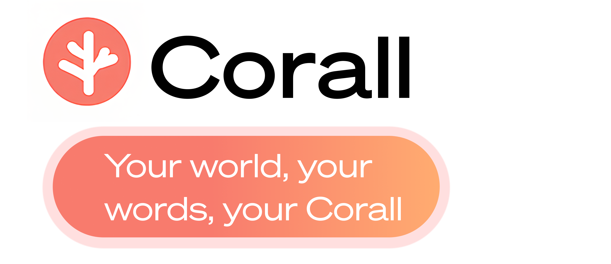

# 🪸 Corall

**Corall** is a modern communication initiative focused on building **secure, private, and human-centered messaging solutions**.
We design tools that make digital conversations seamless, safe, and accessible — for individuals, teams, and communities.

---

## 🛠 What We Build

* **Corall Social** – our flagship social networking service, combining speed, security, and simplicity.
* **Corall Infrastructure** – scalable backend services powering reliable communication.
* **Corall Design System** – a unified set of UI/UX components for consistent, accessible experiences.

---

## 💡 Why Corall?

Most messengers today force a trade-off between **usability, privacy, and trust**.
Corall is designed to remove that compromise:

* End-to-end encryption by default
* Lightweight, modern UX
* Transparent development & open-source values
* Built to scale from private chats to large communities

**Corall isn’t just another messaging app — it’s a communication ecosystem that respects users first.**

---

## 💬 Get Involved

We welcome collaboration from developers, designers, and privacy advocates.
If you’re interested in contributing, partnering, or just learning more, you can:

* Explore our repositories
* Report issues & suggest features
* Join our community discussions
* Reach out via \[contact link / email / Discord]
